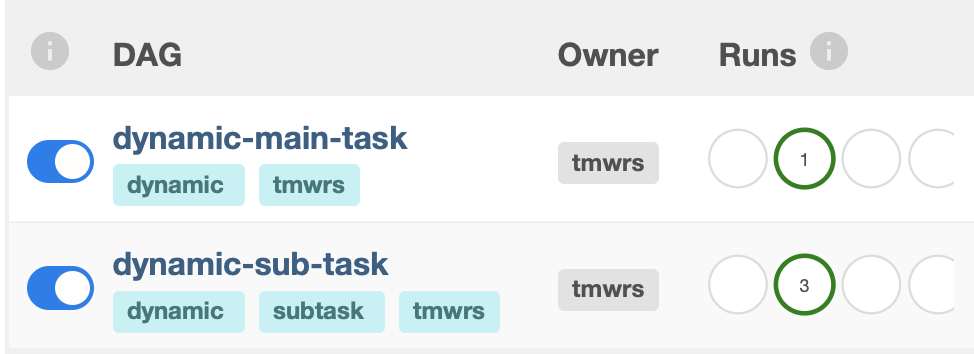

# Create dynamic tasks from triggering multiple DAGRUNs

This DAG shows how to run dynamic multiple tasks from result generated by previous tasks

using `TriggerMultiDagRunOperator` from [airflow_multi_dagrun](https://github.com/mastak/airflow_multi_dagrun)

## Before triggering DAG

There are 2 DAGs which is main task and sub task, main DAG creates dagruns for sub DAG while it does not wait for them to finished, make sure sub dags has its own methods to notify user if failed

## Pipeline

1. source: mimic dict results from multiple sources (dates are rendered and based on `execution_date`)
    * source1: `{"s1":["2021-09-05", "2021-09-04"]}`
    * source2: `{"s2":["2021-09-06"]}`
2. prepare_dynamic: read from `source1` and `source2`, merge the result to list and push to xcom
    * `[{'name': 's1', 'date': '2021-09-05'}, {'name': 's1', 'date': '2021-09-04'}, {'name': 's2', 'date': '2021-09-06'}]`
3. gen_target_dag_run: generate multiple target dagruns with dag_run config
4. dag `dynamic_single_task` generate 3 dagruns with config
    * `{'name': 's1', 'date': '2021-09-05'}`
    * `{'name': 's1', 'date': '2021-09-04'}`
    * `{'name': 's2', 'date': '2021-09-06'}`

## Result

