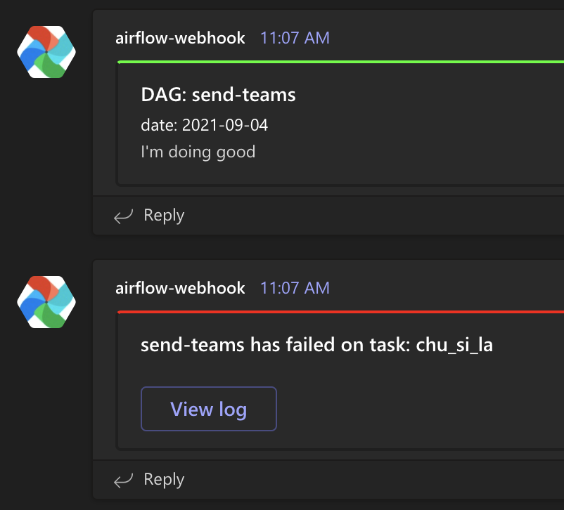

# Send message to teams channel

This DAG shows how to send message to teams channel if success in DAG and send failed message when task failed. Also it shows how to use branch operator.

Note: `ms_teams_webhook_operators` and `ms_teams_webhook_hooks` are modified from [github](https://github.com/mendhak/Airflow-MS-Teams-Operator)

## Before triggering DAG
set `msteams_webhook_url` in Connections with your webhook URL, check [Airflow-MS-Teams-Operator](https://code.mendhak.com/Airflow-MS-Teams-Operator/) for the tutorial, or set by command

```bash
docker exec -it <container_id_or_name> airflow connections add --conn-type http --conn-schema https --conn-host <your_webhook_url_without_https> msteams_webhook_url
```

## Pipeline

1. start
2. branching
    * lucky_you (it will always success)
    * chu_si_la (it will always failed, and send fail message to teams)
3. send_result_to_teams: if all tasks in DAG success, it will send message to teams

Notice: (2) randomly choise one branch, however, you can trigger DAG with config `{"branch": "chu_si_la"}` or `{"branch": "lucky_you"}` to force it to execute target task for testing

## Output

